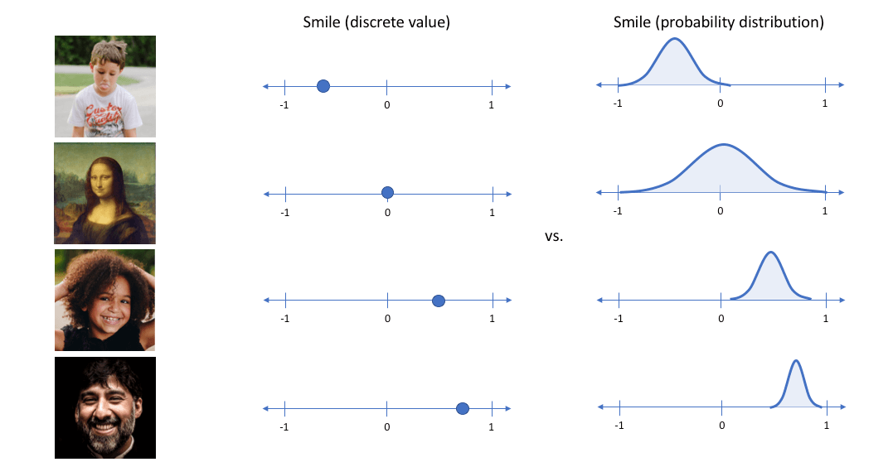

# 复现变分自编码器(`VAE`)

## `VAE`的核心思想

相比于传统的编码器，`VAE`是通过引入隐变量`Z`来使用概率模型的生成模型。

理想形态下的生成模型可以被描述为$X^!=P(Z)$,`Z`是引入的隐变量。如果我们能够将输入样本`X`的一系列特征编码得到`Z`控制在已知的某个分布中，那么就能够在隐变量的分布空间中采样解码得到生成内容$X^!$.

AE将样本编码为离散的点, 而VAE将样本编码为概率分布, 直接点就是给隐变量添加噪声.

那么在Decoder解码时, 从隐变量中随机采样, 得到采样后的向量作为Decoder的输入.

## 理论证明

- 首先一方面我们希望生成的内容$X^!$和原始输入$X$之间的差距越小越好，也就是我们应该极小化`MSE(X!,X)`.

- 另一方面为了防止神经网络过拟合，我们需要极小化$KL(P(X|Z),N(0,1))$来防止神经网络过拟合导致方差趋向0，模型退化为`AE`.

